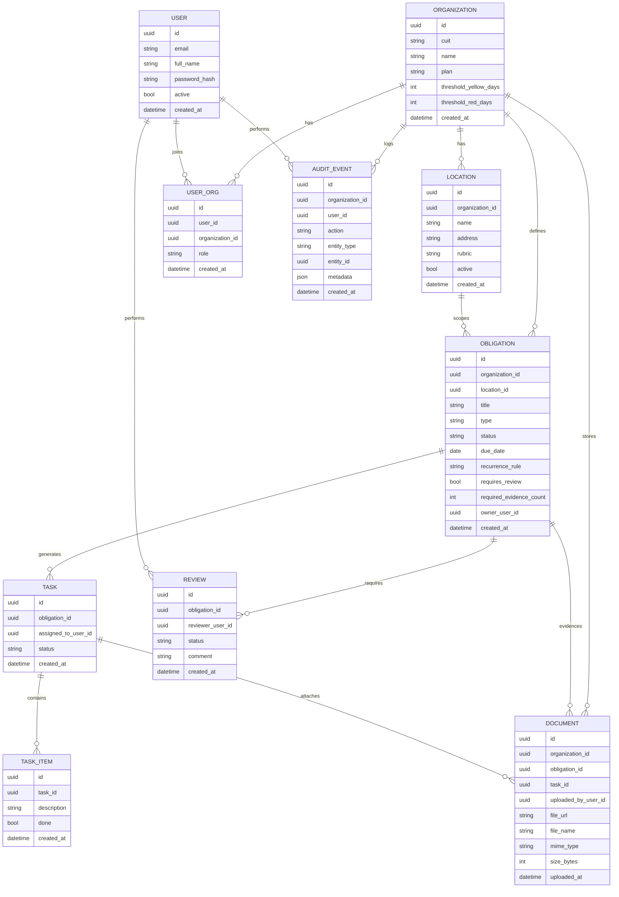

# PF-AyD-ART02 — Modelo de Datos o Diagrama de Clases

## 1. Objetivo
Definir el modelo de datos base para soportar multi-tenancy por Organización (CUIT), con locales, obligaciones, tareas, checklists, evidencias/documentos y auditoría.

## 2. Entidades principales
- Organization
- Location
- User
- UserOrg (membership con rol)
- Obligation
- Task
- TaskItem
- Document
- Review
- AuditEvent

## 3. ERD (Mermaid)

## 4. Reglas de integridad (recomendadas)
- `organization_id` NOT NULL en todas las entidades multi-tenant.
- Índices:
  - `obligation(organization_id, due_date)`
  - `obligation(organization_id, status)`
  - `task(obligation_id)`
  - `document(organization_id, obligation_id)`
- Auditoría append-only.

## 5. Diagrama de clases (alternativo, conceptual)
- `Organization` agrega `Location`, `Obligation`, `AuditEvent`.
- `Obligation` compone `Task` y se asocia a `Document` y `Review`.
- `Task` compone `TaskItem` y referencia `Document`.
