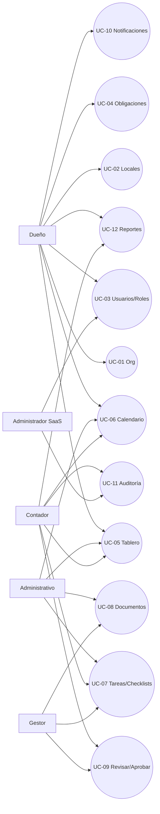

# PF-REQ-ART02 — Modelo de Casos de Uso

## 1. Actores
- **Dueño**: administra organización y controla cumplimiento.
- **Administrativo**: ejecuta tareas y carga evidencias.
- **Contador**: revisa, valida y colabora en cumplimiento.
- **Gestor**: aporta documentación/gestiones específicas.
- **Administrador SaaS**: soporte, monitoreo y operación del servicio.

## 2. Lista de casos de uso

### Administración
- **UC-01** Gestionar Organización (CUIT)
- **UC-02** Gestionar Locales
- **UC-03** Gestionar Usuarios y Roles

### Cumplimiento
- **UC-04** Gestionar Obligaciones
- **UC-05** Visualizar Tablero de Cumplimiento
- **UC-06** Visualizar Calendario de Vencimientos
- **UC-07** Gestionar Tareas y Checklists
- **UC-08** Gestionar Evidencias/Documentos
- **UC-09** Revisar/Aprobar Evidencias

### Operación
- **UC-10** Configurar Notificaciones
- **UC-11** Consultar Auditoría
- **UC-12** Generar Reportes/Exportaciones

## 3. Diagrama de casos de uso (Mermaid)

## 4. Especificación breve de casos de uso (resumen)

### UC-04 Gestionar Obligaciones
- **Actor principal:** Dueño/Admin.
- **Precondición:** Usuario autenticado con permiso.
- **Flujo básico:** crear/editar obligación, definir alcance (org/local), vencimiento, periodicidad, revisión requerida.
- **Postcondición:** obligación registrada y visible en tablero/calendario.

### UC-07 Gestionar Tareas y Checklists
- **Actor principal:** Administrativo.
- **Flujo básico:** crear tarea desde obligación, asignar responsable, completar checklist.

### UC-09 Revisar/Aprobar Evidencias
- **Actor principal:** Contador o Gestor (según permisos).
- **Flujo básico:** revisar documentos, aprobar o rechazar con observaciones.
- **Postcondición:** obligación puede cerrarse si aprobada.
